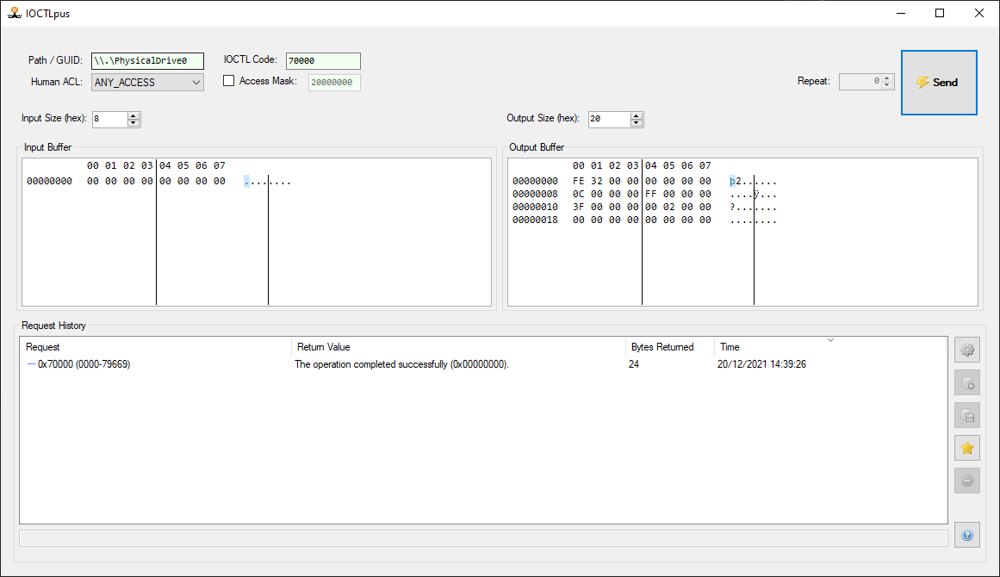

# IOCTLpus


IOCTLpus can be used to make `DeviceIoControl` requests with arbitrary inputs (with functionality somewhat similar to Burp Repeater).

Here is an example of an information leak triggered in a sample vulnerable driver:



If no arguments is passed to IOCTLpus, it will run in GUI mode; if the `--cli` argument is passed it will run in CLI mode.

Example:
`--cli --guid \\.\PhysicalDrive0 --ioctl 70000 -i 32 -o 32 --input 0000000000000000000000000000000000000000000000000000000000000000`

## CLI Usage:

```
  --cli                Run IOCTLpus in CLI mode.

  --guid               Path/GUID of the driver to interact with.

  --ioctl              IOCTL code.

  -i, --input-size     (Default: 32) Input Size (decimal).

  -o, --output-size    (Default: 32) Output Size (decimal).

  --input              Input buffer.

  -r, --repeat         (Default: 0) # of times to repeat the IOCTL request.

  --access-mask        (Default: 20000000) Access Mask.

  --help               Display this help screen.

  --version            Display version information.
```

## Tentative Roadmap

- [x] Create handles using Device Interface GUIDs in addition to symbolic links. [[GIF](https://i.imgur.com/R9WkgHG.gif)]
- [ ] Persist requests to SQLite databases.
- [ ] Apply filters to request history.
- [ ] Integrate Kaitai Struct to define and view buffer structures ([inspired by](https://github.com/kaitai-io/kaitai_struct_webide/wiki/Features)).
- [x] Develop an API to use the tool headlessly (e.g. for fuzzing).
- [x] Design a cool logo.

## Similar Tools

- [jerome-pouiller / ioctl](https://github.com/jerome-pouiller/ioctl)
- [xst3nz / ioctlbf](https://code.google.com/archive/p/ioctlbf/)

## Developers

- Developed in 2017 by Jackson Thuraisamy [@Jackson_T](https://twitter.com/jackson_t)
- Updated in 2021 by Paolo Stagno [@Void_Sec](https://twitter.com/Void_Sec)

## Licence

[GPLv3](https://tldrlegal.com/license/gnu-general-public-license-v3-(gpl-3))
